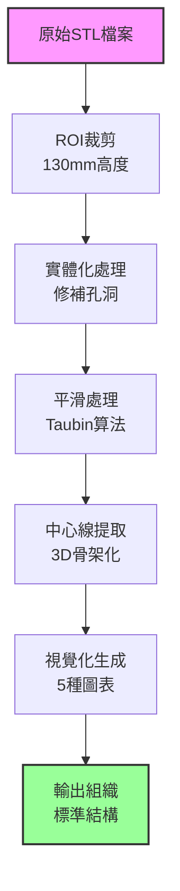

# 血管處理流程指南

## 流程總覽



## 詳細步驟說明

### Step 1: ROI裁剪 (01_roi_crop.py)

**目的**: 統一所有血管高度為130mm

**處理邏輯**:
```python
if 血管高度 > 130mm:
    從底部裁剪，保留上方130mm
else:
    保持原樣
```

**關鍵代碼**:
```python
def crop_from_bottom(mesh, roi_height=130.0):
    z_max = mesh.bounds[1][2]
    new_z_min = z_max - roi_height
    # 裁剪並保留上方結構
```

**輸入/輸出**:
- 輸入: `/original_STL/*.stl`
- 輸出: `/output_bottom_crop/*_bottom_crop.stl`

---

### Step 2: 實體化與平滑 (02_solidify_smooth.py)

**目的**: 確保網格封閉並平滑表面

**處理步驟**:
1. 檢查網格水密性
2. 修補孔洞
3. Taubin平滑（10次迭代）

**關鍵參數**:
```python
smooth_iterations = 10
lambda_factor = 0.5
mu_factor = -0.53
```

**品質檢查**:
- 網格必須封閉
- 無自相交
- 體積保持

---

### Step 3: 中心線提取 (04_centerline_extract.py)

**目的**: 提取血管幾何中心線

**演算法流程**:
1. **體素化** (Voxelization)
   - Resolution: 1.0mm
   - Dilation: 3 iterations
   - Erosion: 2 iterations

2. **骨架提取** (Skeletonization)
   - 3D medial axis transform
   - Fill holes before thinning

3. **路徑排序** (Path Ordering)
   - 起點: Z最高點（頂部）
   - 終點: Z較低且X最小（左下）

4. **曲線優化** (Optimization)
   - Cubic spline interpolation
   - Douglas-Peucker simplification
   - Final: 150 points

**輸出格式**:
- NumPy array: (150, 3) 座標點
- STL model: 管狀結構（r=1.5mm）

---

### Step 4: 批次組織 (03_batch_organize.py)

**目的**: 生成完整輸出結構

**生成內容**:
1. **Figure 1**: 原始3D視圖
2. **Figure 2**: 含中心線視圖
3. **Figure 3**: 角度分析
4. **Figure 4**: XY投影（俯視）
5. **Figure 5**: XZ投影（側視）
6. **Interactive HTML**: 可旋轉3D

**視覺化參數**:
```python
# 標記設置
start_marker = {
    'color': 'green',
    'shape': 'circle',
    'size': 8  # HTML
}
end_marker = {
    'color': 'blue', 
    'shape': 'square',
    'size': 8  # HTML
}

# 中心線樣式
centerline_style = {
    'color': 'red',
    'width': 6,  # 3D視圖
    'alpha': 0.9
}
```

---

## 執行範例

### 基本執行
```bash
cd /Users/julie/folder/vessel/organized

# 單步執行
python 01_pipeline_scripts/01_roi_crop.py
python 01_pipeline_scripts/02_solidify_smooth.py
python 01_pipeline_scripts/04_centerline_extract.py
```

### 批次處理
```bash
# 處理所有檔案
python 01_pipeline_scripts/05_integrated_pipeline.py

# 測試3個檔案
python 01_pipeline_scripts/05_integrated_pipeline.py --limit 3

# 生成報告
python 01_pipeline_scripts/05_integrated_pipeline.py --report
```

### 自定義參數
```python
# 修改ROI高度
ROI_HEIGHT = 150.0  # 預設130.0

# 修改中心線點數
NUM_POINTS = 200  # 預設150

# 修改管徑
TUBE_RADIUS = 2.0  # 預設1.5
```

---

## 輸出檢查清單

### ✅ 必要檔案
- [ ] `*_centerline.npy` - 中心線數據
- [ ] `*_centerline.stl` - 中心線3D模型
- [ ] `*_interactive_3D.html` - 互動視覺化
- [ ] `SUMMARY.md` - 處理摘要

### ✅ 品質驗證
- [ ] 中心線在血管內部
- [ ] 起點在頂部（Z最高）
- [ ] 終點在左下（Z低X小）
- [ ] 標記顏色正確（綠圓/藍方）
- [ ] HTML可正常開啟旋轉

### ✅ 數值檢查
- [ ] 中心線點數 = 150
- [ ] 血管高度 ≤ 130mm
- [ ] 中心線長度合理（50-300mm）

---

## 常見問題

### Q1: 中心線偏離血管中心
**解決**: 調整體素化參數
```python
resolution = 0.5  # 降低解析度（預設1.0）
dilation = 5      # 增加膨脹（預設3）
```

### Q2: 起終點位置錯誤
**解決**: 修改終點搜尋邏輯
```python
z_threshold = np.percentile(skeleton[:, 2], 20)  # 預設30
```

### Q3: 處理速度過慢
**解決**: 啟用並行處理
```python
from multiprocessing import Pool
with Pool(4) as p:  # 使用4核心
    results = p.map(process_file, file_list)
```

---

## 進階設定

### 記憶體優化
```python
# 大檔案處理
mesh.simplify_quadric_decimation(face_count=50000)  # 簡化網格
```

### 批次參數調整
```python
# config.yaml
parameters:
  roi_height: 130
  smooth_iterations: 10
  centerline_points: 150
  tube_radius: 1.5
  voxel_resolution: 1.0
```

### 平行處理
```python
# 使用joblib
from joblib import Parallel, delayed
results = Parallel(n_jobs=4)(
    delayed(process_vessel)(f) for f in files
)
```